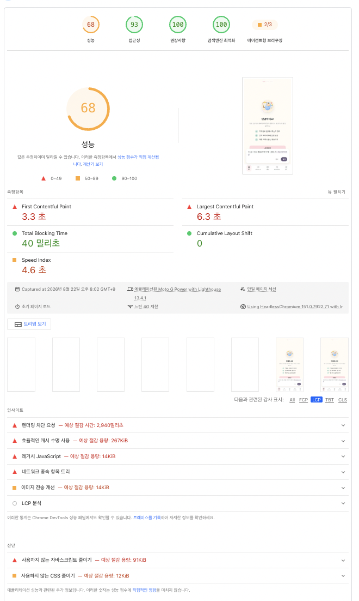
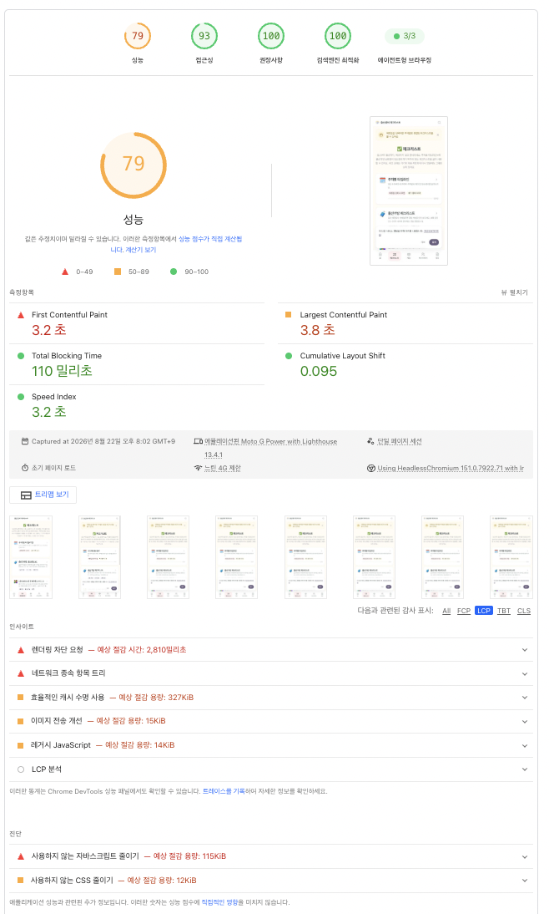
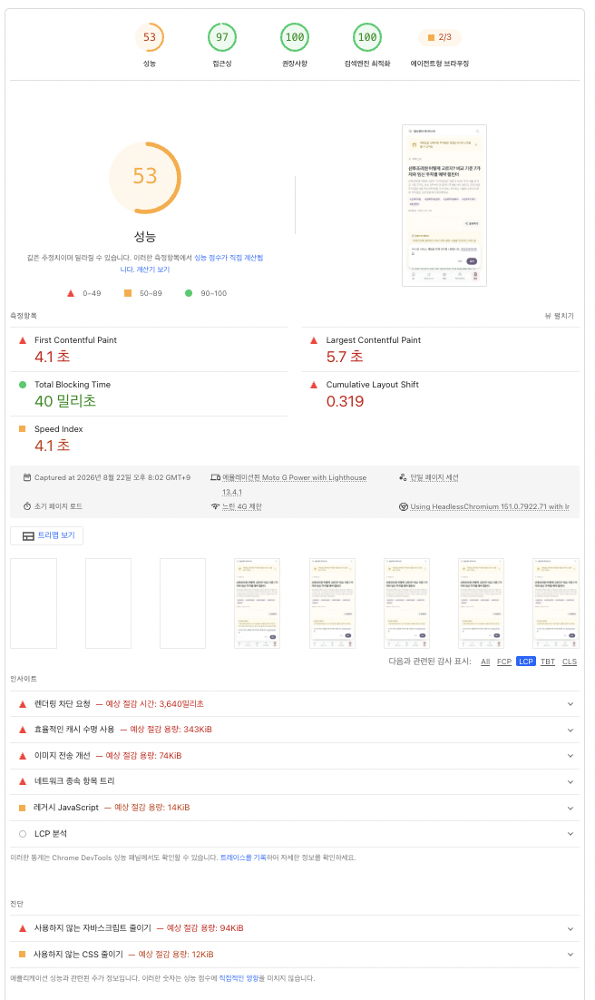

# phase-4.7 LCP 실측 데이터 — 2026-07

> 작성일: 2026-08-22
> 출처: [prenatal-leave-backlog-checklist.md §1.2](../ops/prenatal-leave-backlog-checklist.md#12-psi-diagnostics-lcp-element-캡쳐-예상-30분)
> 목적: [phase-4.7 산후 복귀 후 후속](phase-4.7.md#산후-복귀-후-후속-phase-47-범위-밖) "LCP `<4s` 본격 라운드"용 PSI Diagnostics "LCP element" 데이터 확보. 지금 잡아두면 산후 복귀 후 재측정 없이 바로 원인 분석 시작 가능.

## phase-4.7 종료 시점 baseline (참고)

phase-4.7 R1~R3 머지 후 마지막 측정값 ([phase-4.7.md](phase-4.7.md#종료-처리-2026-07-XX) 표 인용):

| 페이지 | FCP | LCP | CLS | DoD `<4s` |
|---|---|---|---|---|
| 홈 (`/`) | 3.0s | 5.7s | 0 | ❌ 미달 |
| 허브 (`/checklist`) | 3.2s | 4.4s | 0.094 | ❌ 미달 (턱밑) |
| 발행 글 | 4.2s | 5.6s | 0.094 | ❌ 미달 |

당시 원인 추정 (미확정, 아래 실측으로 반증됨): 홈은 H1 텍스트 / DueDateInput 카드 / dashboard 카드 중 하나가 LCP candidate로 의심했으나, 실측 결과 3개 페이지 모두 본문 `
` 텍스트 요소로 확인 — 원래 추정과 다름.

---

## 홈 (`https://pregnancy-checklist.com/`)

**측정 일시**: 2026.08.22

**PSI Diagnostics — Largest Contentful Paint element**

**수치**

| FCP | LCP | CLS |
|---|---|---|
| 3.3 초 | 6.3 초 | 0 |

**LCP element** (스크린샷에서 확인한 실제 요소):

- `
`

---

## 허브 (`https://pregnancy-checklist.com/checklist`)

**측정 일시**: 2026.08.22

**PSI Diagnostics — Largest Contentful Paint element**

**수치**

| FCP | LCP | CLS |
|---|---|---|
| 3.2 초 | 3.8 초 | 0.095 |

**LCP element**:

- `
`

---

## 발행 글 (`https://pregnancy-checklist.com/articles/postpartum-care-center-guide`)

**측정 일시**: 2026.08.22

**PSI Diagnostics — Largest Contentful Paint element**

**수치**

| FCP | LCP | CLS |
|---|---|---|
| 4.1 초 | 5.7 초 | 0.319 |

**LCP element**:

- `
`

---

## 요약 (3개 다 채운 후 기록)

| 페이지 | FCP | LCP | CLS | LCP element | baseline 대비 |
|---|---|---|---|---|---|
| 홈 | 3.3 초 | 6.3 초 | 0 | `
` | |
| 허브 | 3.2 초 | 3.8 초 | 0.095 | `
` | |
| 발행 글 | 4.1 초 | 5.7 초 | 0.319 | `
` | |

## 다음 단계 (산후 복귀 후)

이 데이터를 가지고 [phase-5.md](phase-5.md)에 "LCP `<4s` 본격 라운드" 항목으로 착수 — 페이지별 LCP candidate 정조준 후 최적화.
